<div style="text-align:center;">
	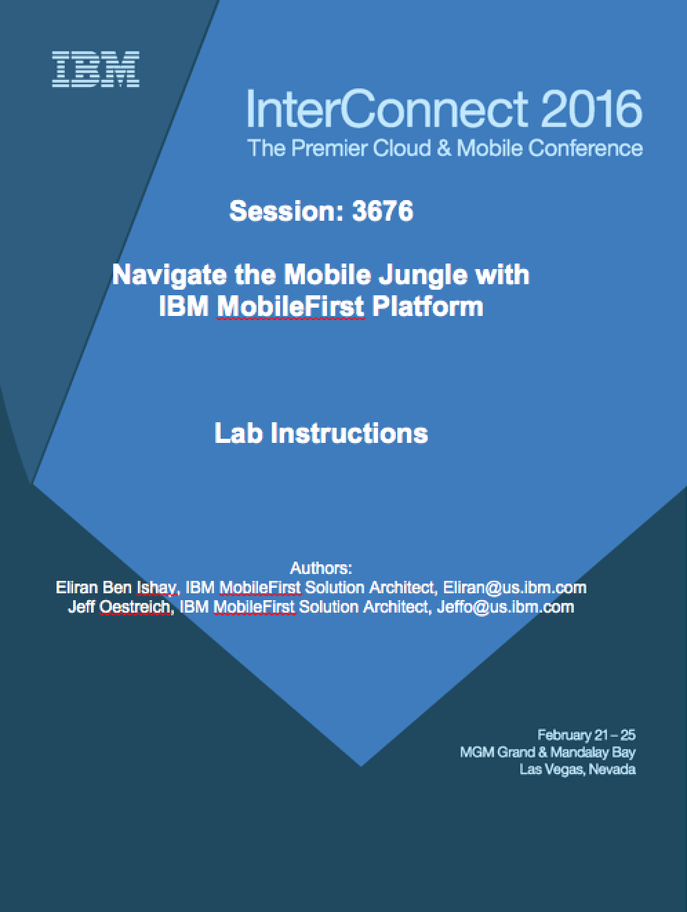
</div>

# Lab 3676 - Navigate the Mobile Jungle with IBM MobileFirst Platform!

- - - 
# Introduction


Mobile application development is challanging, its involvede verious components and different requirements from both LOB and IT, some of the chllanges includes things like: how do I make sure my application is secure?, how can I manage the different iteration and version of my applications?, does my users using my application? and what features they are using or not using?.

This lab is a guided tour of the IBM MobileFirst Platform. It may be "a jungle out there," but through these activities you'll understand how IBM MobileFirst Platform can help you find your way out. 

In this set of labs we will demonstrate how to take an existing Ionic/Cordova application and import it into a MobileFirst Platform application, then demonstrate some of the capabilities provided by MobileFirst.  We will cover bootstrapping, using MFP Application Access, MFP Adatpers, and MFP Operational Analytics.

The activity will start with an Ionic project that we have already created (see git repo below).  The application is an Employee Directory application, named IBMTechEXEmployee.

The following exercise includes 6 micro labs (~10 min each)

- Micro Lab # 1 - Creating Cordova hybrid base application with MFP CLI
- Micro Lab # 2 - Import your existing Ionic/Angular code to MFP App
- Micro Lab # 3 - Load MFP framework and application Bootstrapping
- Micro Lab # 4 - Preview your application and adding MFP Backend project
- Micro Lab # 5 - How to manage your application access
- Micro Lab # 6 - Overview MFP Operational Analytics

<!--- 
- Micro Lab # 7 - How to capture custom events (Optional)
- Micro Lab # 8 - How to create custom charts (Optional)
-->

### Source code for labs

In order to get the latest code for the ionic application, run the following git command:

     git clone https://github.com/eliranbi/InterConnect2016.git


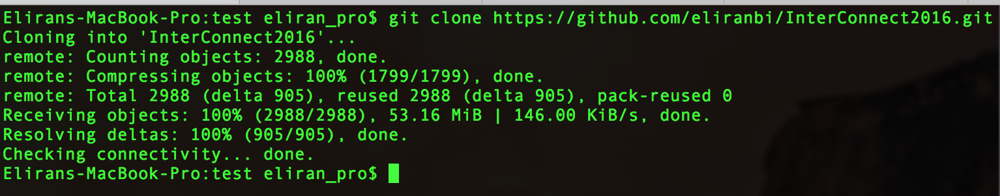

Once you clone the repo you will notice the following directories :

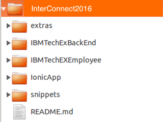

- **IBMTechExBackEnd** - Is our MFP/Cordova completed directory application.

- **IBMTechEXEmployee** - Is MFP backend project that contains the adapters which implement the back-end integration code.

- **IonicApp** - Is our base Ionic Application that we are going to import into MFP.

In later steps, a **/snippets** folder will be added here, during a git checkout step.  This folder will contain a collection of copy/paste fragments to simplify making the required source code changes in the labs. They are labeled by lab name and task, and should be easy to locate and use. 


### Tools used in labs

In this lab we will use the following tools :

1. The MFP Command Line Interface (CLI) to interact with the MobileFirst Plaform, create projects, create adapters, deploy to the mfp server, view our mfp console etc.
2. Your choice of IDE to edit the code.  The Brackets IDE was used throughout these labs and can be downloaded from here :  <http://brackets.io>.  Brackets is a modern, open source text editor that understands web design.
You can also use the Brackets Extension manager to install additional plugins for code assistant and live preview. The extensions that are used in this tutorial are:

     - ionic-brackets.
     - Ionic Framework Code Hinting.
     - Brackets Beautify

  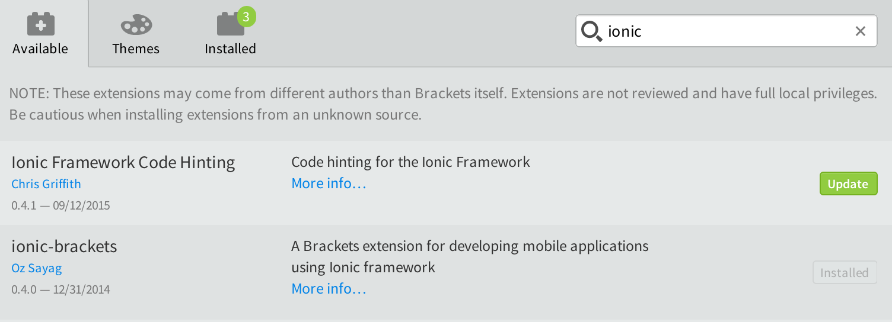

### Preview the Ionic app

Lets start with preview our existing Ionic Employee Directory application.

1. Start Brackets and choose “Open folder” and select the IonicApp folder.

  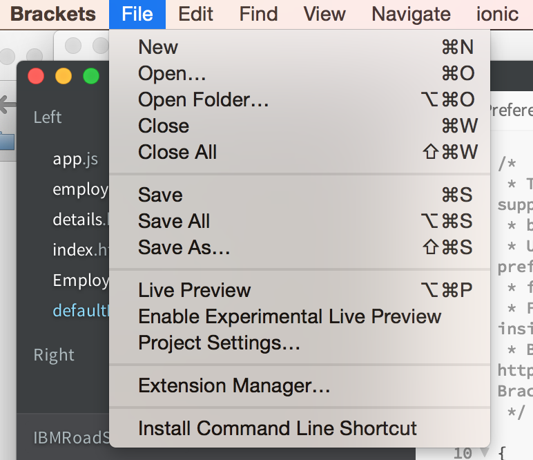

2. Use the Brackets file Navigator to locate and click on **IonicApp/www/index.html**.
3. Click the **lighting** icon in the upper right portion of the Brackets window to preview the completed application in the browser.

  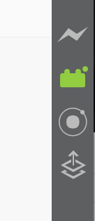

  You can use any combination of user name and password to login
  
  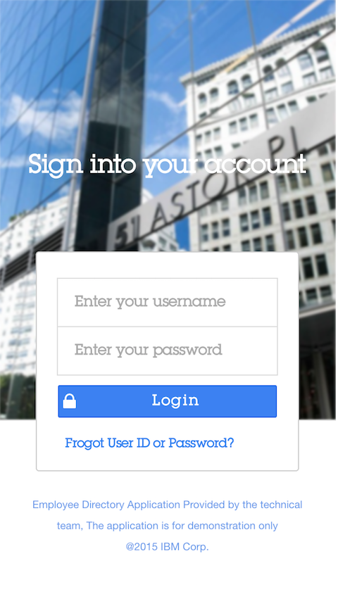
  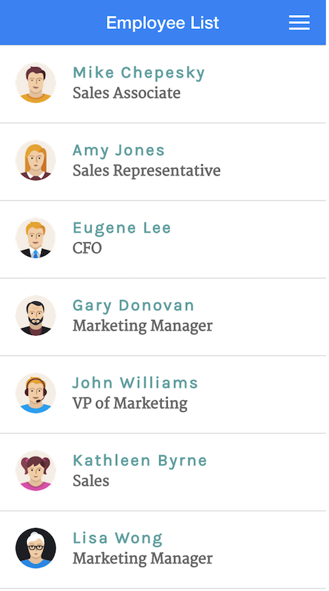

  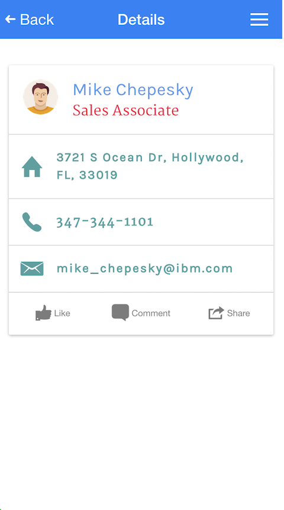
  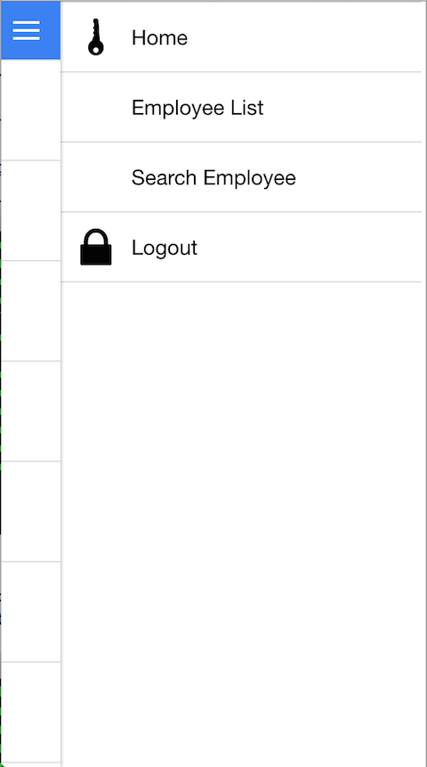


### Intor Summary

You now have the completed and operational Ionic application in your initial workspace.  In the next lab we will reset our workspace to a known starting point using 'git checkout'.  In later labs you will be able to use 'git checkout' to get the working project code, in case you get into trouble.


- - -
# Micro Lab 1 - Creating Cordova hybrid base application with MFP CLI

In this short lab (10min) we are going to create a new MFP/Cordova based application using the MFP CLI.  In a subsequent lab we will merge our Ionic app source into this MFP Cordova app container.

##Steps

1. Start a command line terminal (i.e. `cmd` on Windows or `terminal` on OS X and Linux).

2. Change context to the **InterConnect2016** directory:

        cd InterConnect2016
        
4. In order to start from a known point for the first lab run the following command:

        git checkout -f step-0
        
     (this checkout will also add the **/snippets** and **/extras** folders for use in the editing steps later on)
        
3. Create a new MobileFirst Platform Cordova project with the following command:

        mfp cordova create
    
    You will be prompted for a name for your application.  Enter **`IBMTechEXEmployee`**.
    Accept the defaults for **package ID** (com.ibm.IBMTechEXEmployee), **app version** and **platforms**.

  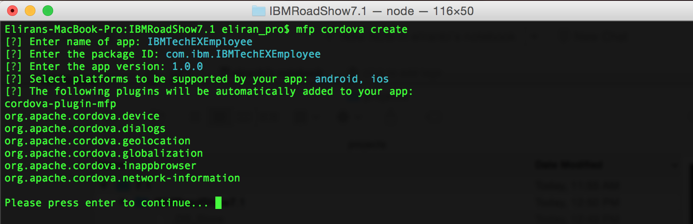

  When prompted for plugins, don’t select anything and just press **Enter** twice.

  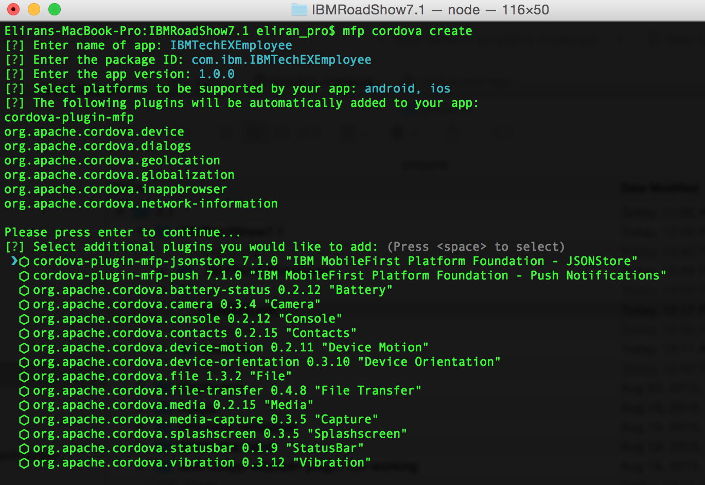

  Press **Enter** to select the default when prompted for a template path
  
  If you been prompt to select ip address in case Multiple ip addresses are avaialble, please select the first one, and press **Enter**
      
     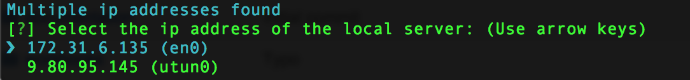
     
  At the end you should get the following message

  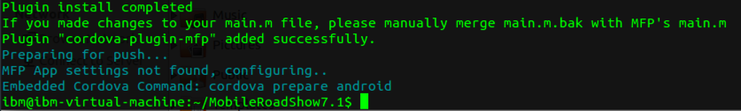

  If you look at your directory you should see the following:
  
  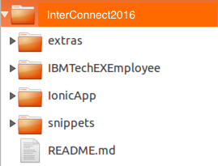
  
   (For more information on MFP+Cordova integration, please see the Getting Started module at: <https://developer.ibm.com/mobilefirstplatform/documentation/getting-started-7-1/foundation/hello-world/integrating-mfpf-sdk-in-cordova-applications/>)

5. Lets explore the different folders.  The IBMTechEXEmployee folder contains an entire Cordova application.  The `www` folder contains the html, images, css and JavaScript files for the app.  The other folders and files contain the MobileFirst-specific artifacts.

  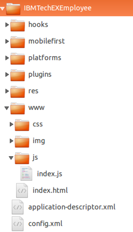

##Micro Lab 1 - Summary

You used the MobileFirst Platform Command Line Interface (MFP CLI) to create a new Cordova-based MobileFirst project that will become your Employee Directory app.  The CLI generates the project structure including a template application.

If you were unable to complete this lab, you can catch up by running this command:

     git checkout -f step-1


- - -
# Micro Lab 2 - Import your existing Ionic/Angular code to MFP App

In this lab, we will merge the existing Ionic application code from the IonicApp project into the IBMTechEXEmployee MobileFirst project.  These will be the typical steps you will need to go through in order to enable your existing Ionic/Angular Cordova based application to use the MobileFirst Platform.

General Steps:

1. Create a new MFP 7.1 Cordova App (You did this as part of Lab #1).
2. Create a new, temporary folder
3. Move the contents of www/ to the temporary folder.  This is really just a backup. Very little of the template files created by MobileFirst when you created the Cordova project will be used.
4. Copy the Ionic web app to www/
5. Adjust app as necessary
6. Use mfp plugin add to add any additional plugins
7. Deploy the app to the mfp development server

Reference: <http://www.raymondcamden.com/2015/08/19/developing-ionic-apps-with-mobilefirst-7-1>

##Steps

1. Change context into the MobileFirst project.

        cd IBMTechEXEmployee
        
2. Create a new ‘**tmp**' folder inside the **IBMTechEXEmployee** folder.

        mkdir tmp

2. **Move** the ‘www’ content to ‘tmp’ folder using

        mv www/* tmp

  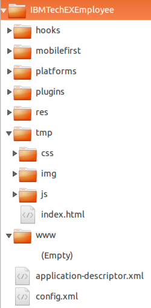

3.  **Copy** the Ionic web app to the ‘www’ folder

        cp -r ../IonicApp/www/* www/

4.  Your **www** folder should look like this now :

  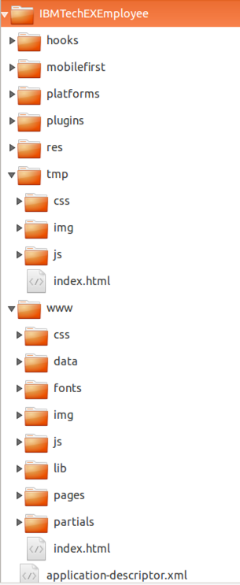

##Micro Lab 2 - Summary
In this lab, you enabled the MobileFirst Platform functionality for your existing Ionic application by moving the existing code into a blank MobileFirst Cordova application project.

If you were unable to complete this lab, you can catch up by running this command:

     git checkout -f step-2

   

- - -
# Micro Lab 3 - Load MFP framework and application Bootstrapping

At this point, you have a MobileFirst Cordova application project, with Ionic-built application logic.  Unfortunately, when we replaced the /www folder during Lab2, we "lost" the MFP JavaScript that enables basic MobileFirst capabilities.  This MFP JavaScript code was included in the default application created by the 'mfp cordova create' step, which is now in your renamed `/tmp` folder.  

In this lab, you will add this MFP JavaScript code to the Ionic application source and bring up the new application in an emulator.  

>Note:  For this lab there are snippets files included in the **/snippets** folder of your workspace which can be used to quickly copy/paste the large source code blocks below.

##Steps

1.  Open the **IBMTechEXEmployee** project using your favorite IDE. You are going to copy some code from the saved `tmp/js/index.js` file to the `app.js` file in your MobileFirst project.

  > Note:  You may use any IDE you like to perform the labs.  The examples shown use the Brackets IDE.

2. Open the **`app.js`** file in the folder **`IBMTechEXEmployee/www/js`** and add the following code immediately after the declaration of ibmApp and just before the comment “//application config":

   ``` javascript
  
     //Adding support for cordova.
         ibmApp.run(function($ionicPlatform) {
               console.log('>> ibmApp.run ...');
               $ionicPlatform.ready(function() {
                 // Hide the accessory bar by default (remove this to show the accessory bar above the keyboard
                 // for form inputs)
                 console.log('>> ibmApp.ready ...');
                 if (window.cordova && 
                     window.cordova.plugins && 
                     window.cordova.plugins.Keyboard) {
         			    cordova.plugins.Keyboard.hideKeyboardAccessoryBar(true);
                 }
                 if(window.StatusBar) {
                   StatusBar.styleDefault();
                 }
               });
             });

   ```


3. Within **`app.js`** scroll to the very bottom of the file and add the following code (locate snippet for copy/paste in the **/snippets** folder):


   ``` javascript

   //Adding MobileFirst
    var Messages = {
        // Add here your messages for the default language.
        // Generate a similar file with a language suffix containing the translated messages.
        // key1 : message1,
    };
   
    var wlInitOptions = {
        // Options to initialize with the WL.Client object.
        // For initialization options please refer to IBM MobileFirst Platform Foundation Knowledge Center.
    };
   
    // Called automatically after MFP framework initialization by WL.Client.init(wlInitOptions).
    function wlCommonInit(){
        // Common initialization code goes here
        console.log('MobileFirst Client SDK Initilized');
        angular.element(document).ready(function() {
            mfpMagicPreviewSetup();
            angular.bootstrap(document.body, ['ibmApp']);
        });
    }
   
    function mfpMagicPreviewSetup(){
        //nothing to see here :-), just some magic to make ionic work with mfp preview, similar to ionic serve --lab
        if(typeof WL !== 'undefined' && WL.StaticAppProps && WL.StaticAppProps.ENVIRONMENT === 'preview'){
            //running mfp preview (MBS or browser)
            if(WL.StaticAppProps.PREVIEW_ENVIRONMENT === 'android'){
                document.body.classList.add('platform-android');
                ionic.Platform.setPlatform("android");
            } else { //then ios
                document.body.classList.add('platform-ios');
                ionic.Platform.setPlatform("ios");
            }
        }
    }
   
    // Useful for ionic serve when MFP Client SDK is not present and wlCommonInit doesn't get called automatically
    var serveTimeout = 1500;
    window.setTimeout(function(){
        if(typeof WL === 'undefined'){
            console.log('MFP Client SDK timeout, running Web App');
            angular.bootstrap(document.body, ['guardianApp']);
        }
        }, serveTimeout);
   
   ```

4. Open the **`IBMTechEXEmployee/www/index.html`** file and remove the ng-app tag from the html body tag.

   Before :
   
   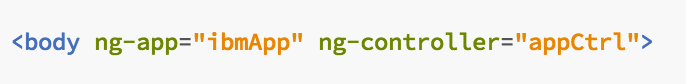
   
   After:
   
   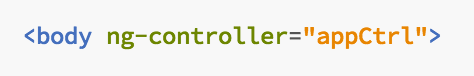

5. The original MFP Cordova project also contained a thumbnail image used by the MFP Console.  Copy the image file from /tmp/img/thumbnail.jpg into /www/img/thumbnail.jpg.  This is not critical, but will avoid a CLI message in later steps.  Use the Files app or the `cp` command in the terminal to copy from `IBMTechEXEmployee/tmp/img/thumbnail.png` to `IBMTechEXEmployee/www/img/thumbnail.png`


### Preview the application


There are two options available to preview the application :

- Use the **mfp cordova emulate** command 
  - The emulate command launches an android virtual device or Xcode iOS simulator       
- Use the **mfp cordova preview** command.  
  - The preview command provides options of: 
       - Simple browser rendering or 
       - Mobile Browser Simulator rendering

The **mfp cordova preview** command provides easy preview, testing, and debugging of applications using the embedded browser debugger. The Mobile Browser Simulator feature also supports many Cordova device emulation controls for items such as GPS and accelerometer.  However, this requires the creation of a corresponding MobileFirst backend project.  We will get to that in the next lab, so for now you will use the emulate command.

1. Use the mfp cordova emulate command which will allow you to choose between the platform you choose to add:
android or iOS.  
  > Note that iOS will only be available if you are working from a machine running OS X.  

        mfp cordova emulate

  Selecting a mobile platform allows you to then select a specific device.  The list of available devices will depend on the type of host machine you are running on and which Android Virtual Devices are installed.
  > Note: If you are running on the provided VM, you will only have the **Nexus\_5\_API\_22\_x86** device available.

  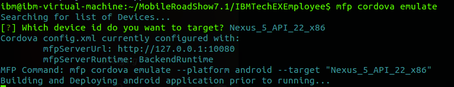

2.  In a few moments, the application will start up in an Android emulator window.


    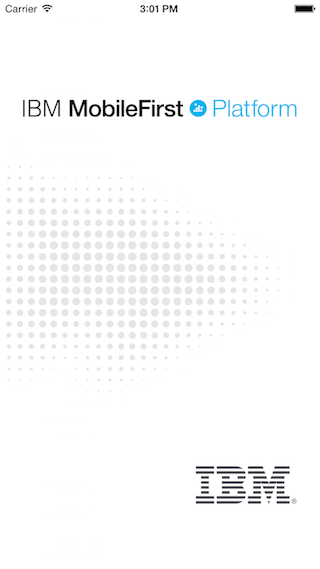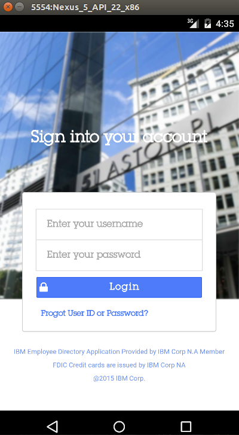

3. Close the Emulator when finished.

##Micro Lab 3 - Summary
In this lab, you enabled the MobileFirst project to use the services provided by the platform by adding code to the main app.js file.  Additionally, you added code to bootstrap Cordova.

If you were unable to complete this lab, you can catch up by running this command:

     git checkout -f step-3
     

- - -
# Micro Lab 4 - Add the MFP Backend project and preview your application

One of the components provided with the MobileFirst Platform is the Mobile Browser Simulator (MBS).  MBS can also be used to preview the application.  In contrast to the `mfp cordova emulate` command, the `mfp cordova preview` command does not require a platform emulator (such as Android Virtual Device) - it operates entirely in the browser.  The simulator also enables you to leverage browser developer tools such as the debugger, style editor and inspector.

The Mobile Browser Simulator requires a MobileFirst backend project and MFP development server to operate.  The backend project will be deployed onto the MFP development server and will enable you to use the adapter framework and the built-in management capabilities and analytics capabilities of the MFP server.

##Steps
1. Change your directory context to **InterConnect2016**.

        cd ..
        
2. Create a new MobileFirst project for the backend.

        mfp create

  When prompted, provide the name **`IBMTechExBackEnd`** for the project name.

  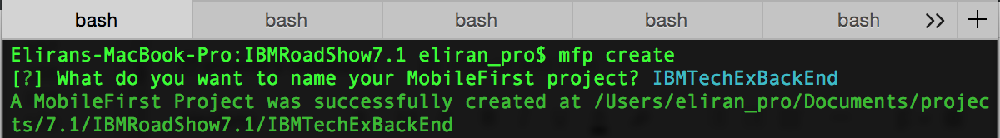

  Your project should look like this :

  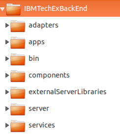

3. Within the terminal navigate to the **`IBMTechExBackEnd`**.

        cd IBMTechExBackEnd

4. The MobileFirst Platform CLI comes with a Development server based on Liberty that you can use to test the backend components of your application.  Start the **MFP Development Server**.  Note that if the server does not yet exist, it will be created the first time you invoke this command.

        mfp start

  You should get the following message :

  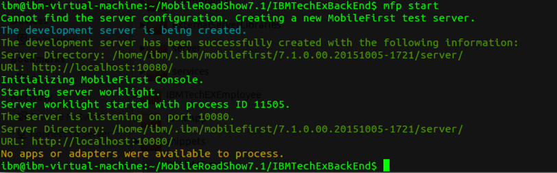

5. The Operations Console is a browser-based interface through which you can manage artifacts deployed to your server.  View the **Operations Console** by running

        mfp console

  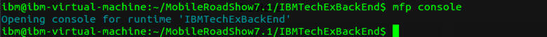

  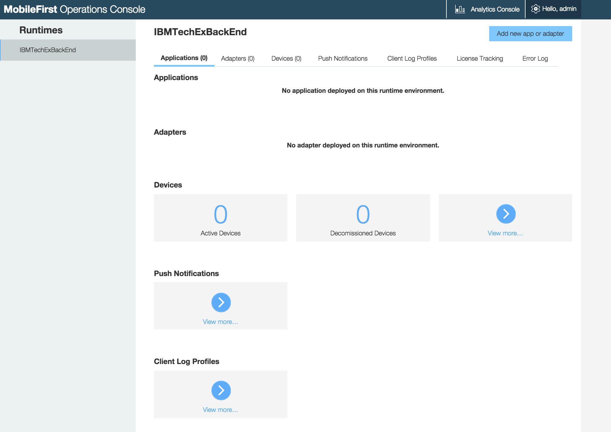
  
  The Operations Console indicates that there are no applications nor adapters deployed yet.  You will deploy your artifacts in the next steps.

6. **Close** the browser

7. Push the backend application to the MFP server.

        mfp push

  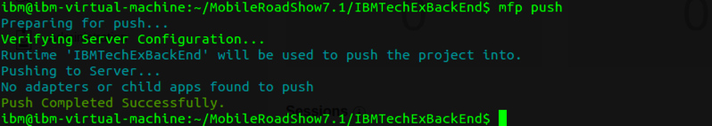

8. Navigate back to the **IBMTechEXEmployee** directory.

        cd ../IBMTechEXEmployee
        
9. Preview the app

        mfp cordova preview

  1. When prompted, use the arrow keys and spacebar on your keyboard to select **`mbs: Mobile Browser Simulator`** and press **Enter**.
  
  2. When prompted, select the **`android`** platform and press **Enter**.
  
  The default browser should be launch and you should see the following screen

  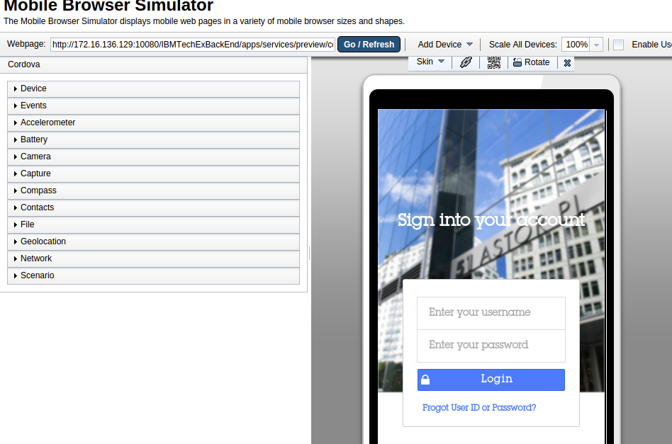
 
  The Mobile Browser Simulator provides methods to interact with your app through Cordova.  Using the menus on the left side of the browser window, you can control interfaces such as Geolocation, Accelerometer and Network.

3. Close the browser.
  
##Micro Lab 4 - Summary
In this lab, you created a new MobileFirst project that will include the back end components of your application, such as adapters.  

You also used the MobileFirst Mobile Browser Simulator to test your application.

If you were unable to complete this lab, you can catch up by running this command:

     git checkout -f step-4


- - -
# Micro Lab 5 - Use the MFP Management features

With the MFP backend project in place on the server side, you will now add code to the client app to manage your application and apply some of the build-in security feaures of the platfrom.

>Note:  For this lab there are snippets files included in the **/snippets** folder of your workspace which can be used to quickly copy/paste the large source code changes in the lab steps below.

##Steps

###1. Modify app.js to connect to the MFP server on application startup

Right after the mobile first platform SDK was initialized the framwork call automatily to **wlCommonInit()** function.  
We will add a piece of code which will connect to the MobileFirst server.

1. Open the **app.js** file in **IBMTechEXEmployee/www/js**.  
2. Find the ** wlCommonInit()** method.  You will add some code to use MFP Client API. 
3. Right after **angular.bootstrap(document.body, ['ibmApp']);** add the following, below (*use the corresponding snippet file in **/snippets** to copy/paste*):

   ``` javascript
		function wlCommonInit() {
		    // Common initialization code goes here
		    console.log('MobileFirst Client SDK Initilized');
   			 angular.element(document).ready(function () {
       		 mfpMagicPreviewSetup();
		        angular.bootstrap(document.body, ['ibmApp']);
   			     //adding call to mfp server 
       		  WL.Client.connect({
	     				onSuccess: function(rsp){
                 		   console.log(">> WL.Client.connect() -  onSuccess :" + rsp);
                },
                		onFailure: function(rsp){
       		             console.log(">> WL.Client.connect() -  onFailure :" + rsp);
                }
	     });        
    });
}

   ```
  
  **Screenshot Before:**  
  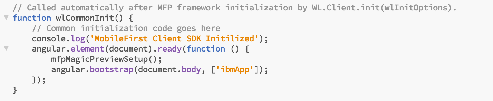

  **Screenshot After:**
    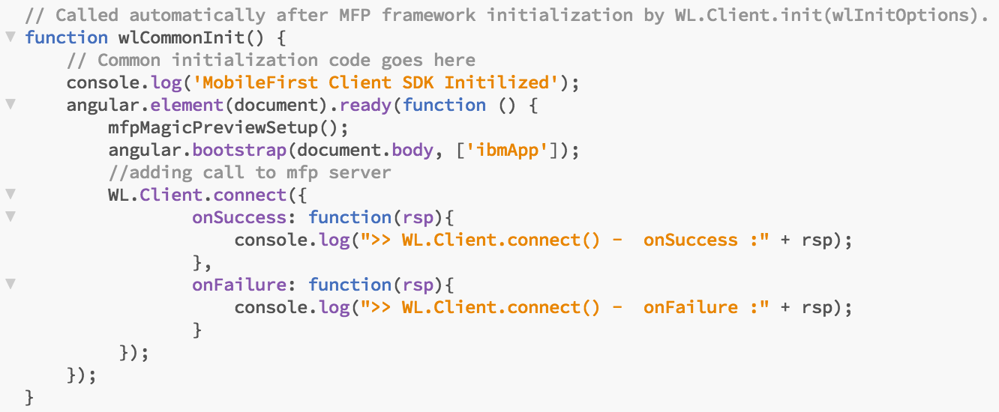

4. **Save** your updates!

### 2. Test the changes

1. Return to the command line and ensure you are in the `IBMTechEXEmployee` folder 

2. Run the application using

        mfp cordova emulate

   > If you get an error using the mfp cordova preview (or you simply get a blank employee list) make sure you clean your browser cache.  Also make sure you are invoking the command from the IBMTechEXEmloyee directory.

3. You should see that the Application login screen.

	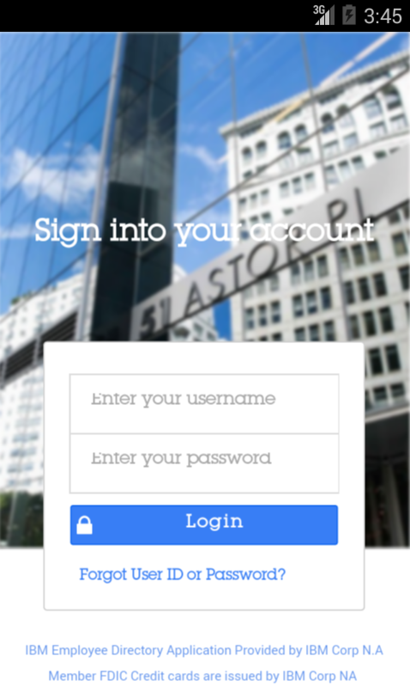

4. Press the **Back Button** to exit the application.

###3. Modify the Application Access control and start the application again.

The mobile first server preform several security checks when the application start, lets start the console and check some of the MobileFirst build in features.

1. Start the MobileFirst server console
		
        mfp console
        
2. Press on the application name **IBMTechEXEmployee** under applications.

	   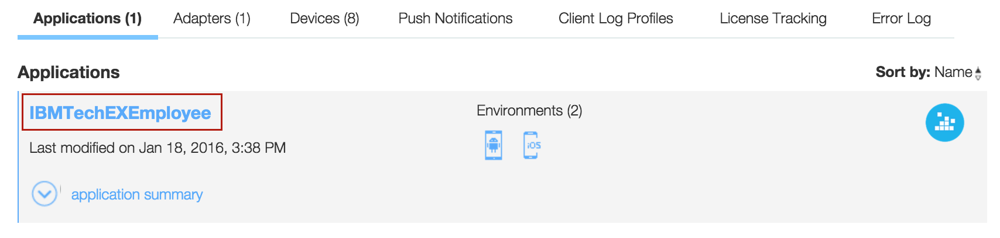

3. Make sure that the **Android** environment is selected 

	   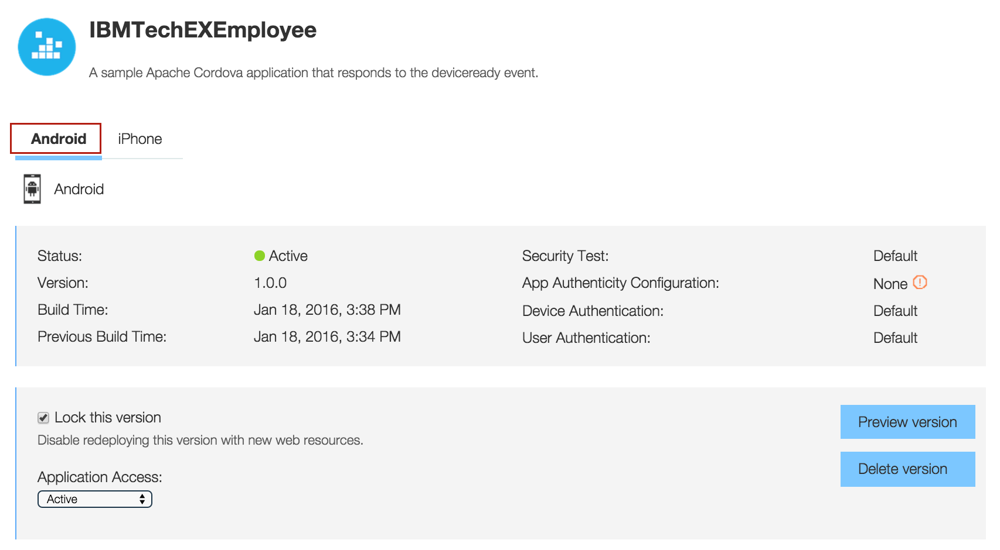

4. Under **Application Access** select the **Active, notifying** option and under the **Default notification message:** enter "Welcome to InterConnect 2016 Lab - New Application is coming soon." and press the **Save** button.

	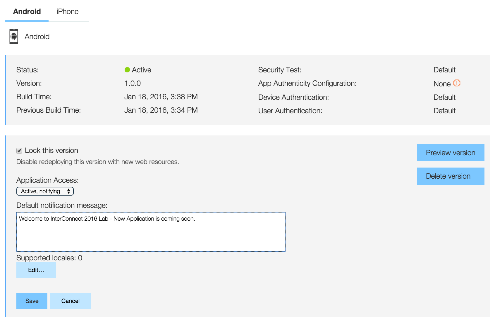

5. Press the **Save** button (*you should see notification indicating your change has been saved*) 

	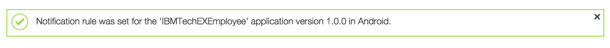

###4. Verify your changes

1. Run the application again on the Android emulator (*if the emulator is already runing, you can just press on the application ionc to start the application*) 
    
    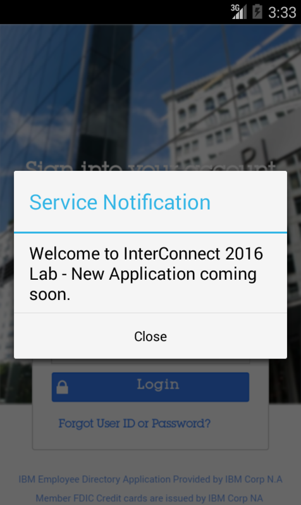  
        


## Micro Lab 5 - Summary

In this lab, you modified the client code to use the MobileFirst Managment capabilites, this is a very simple example of one of the MobileFirst server features but there are more (Direct update, Application Authenticty, Certificate Pinging, etc).

If you were unable to complete this lab, you can catch up by running this command:

     git checkout -f step-5
     

---
# Micro Lab 6 - Connecting our mobile app to our StrongLoop API using MFP WLResourceRequest API (Client side)

If you have looked at the code in app.js in detail, you have noticed that the app is currently using the Employee service and Employee Details controllers. These services use angular $http services to get the application data, which is stored in .json files locally on the device. In the next section, you will use the WLResourceRequest API to get data from back-end services. 

The MobileFirst WLResourceRequest API is a REST client api provided in the MobileFirst client SDKs (hybrid and native) that integrates with MobileFirst security and analytics, enabling consistent security to back-end resources and ability to record, measure and compare the operational characteristics of the REST API traffic - volumes, servers, response times, etc...


In this lab we will access our StrongLoop REST API directly from our mobile app, using the WLResourceRequest API, and demonstrate how we can leverage the features and benefits of being a MobileFirst Platform application.


### Populate the StrongLoop data source
Before we test our app against our StrongLoop API, we we need to populate our backend API with data.  Since we are using an in-memory datasource with a json file backing store, we could just replace the .json.  Instead we will use a node script to populate our data source through our RESTful API.

Lets get started :

1. Run the SL server, Navigate to your SL project folder and run the following command :
   
   ```
   cd ~/InterConnect2016/SLTechExEmployees
   node .
   ```
   
2. Open the browser and navigate to **http://127.0.0.1:3000/explorer**
   
   <!-- 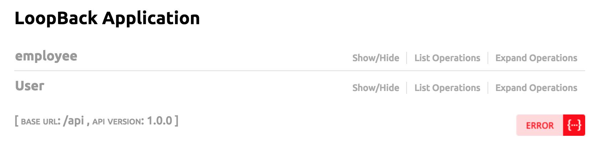  -->
   
   
3. Click the **employee -> Get** link
   
   <!-- 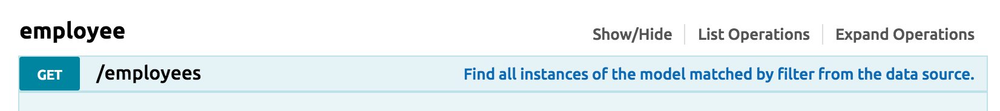  -->
   
   
4. Click the **“Try it out”** button and make sure you get a list of employees as the results
   
   <!-- 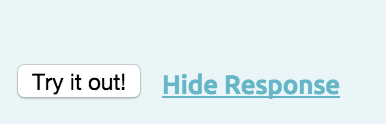  -->
   

   <!-- 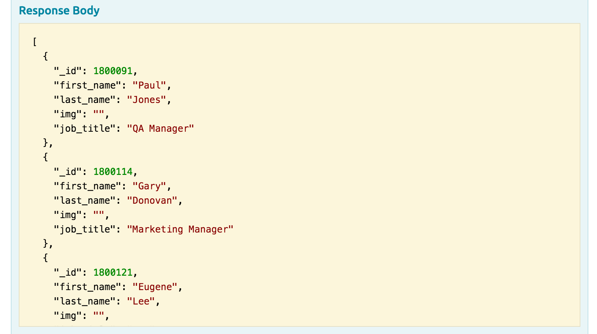  -->
   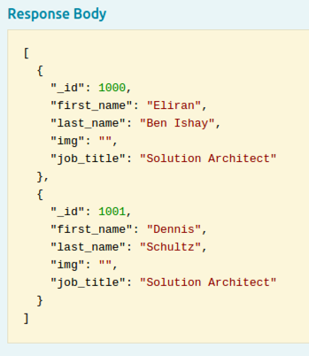
   
   You should see just one or two results rows, based on what was manually created in the previous lab.  Now you will run a node script that will repopulate the employee list with data for the sample application.

5. Open a second Terminal and navigate to the **server** folder within the **SLTechExEmployee** StrongLoop app:    
   
        cd ~/InterConnect2016/SLTechExEmployee/server
   
6. Install node modules required to run the script.

        npm install async fs request
        
7. Copy the node script **import-employees.js** from the extras folder to the server folder
   
        cp ../../extras/import-employees.js .
   
   > NOTE: Feel free to explore this file and see what it does.
     
7. Issue the following command to invoke the *import-employees.js* script
   
        node import-employees.js
   
8. Return to your browser and press on the **“Try it out”** button again to GET employees. You should see a list of many more employees returned in the response.

       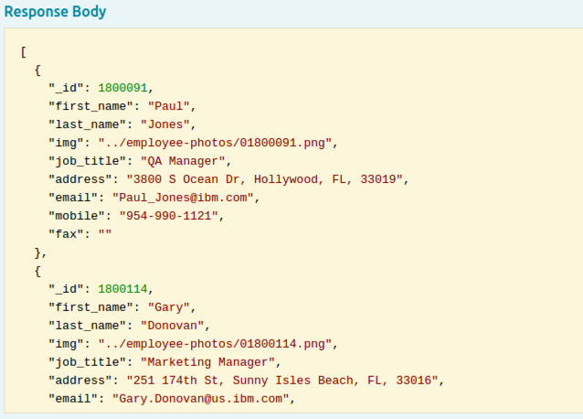
       
##Steps

### 1. Modify the mobile application to call the StrongLoop API

Now that we have the SL API running and populated we will modify our IBMTechEXEmployee project using Brackets

1. Open the **app.js** file in **IBMTechEXEmployee/www/js**.  
2. Find the **EmployeeService** method.  You will replace the method implementation to use MFP Client API instead of the Angular $http services.
3. Replace the implementation of the **EmployeeService** method with the code, below (*use the corresponding snippet file in **/snippets** to copy/paste*):

   ``` javascript
     
		ibmApp.factory("EmployeeService", function ($http) {
		    console.log(">> in EmployeeService ...");
		    var employees = [];
		    var resourceRequest = new WLResourceRequest(
		        "http://127.0.0.1:3000/api/employees", WLResourceRequest.GET
		    );
		    return {
		        getEmployeeList: function () {
		            return resourceRequest.send().then(function (response) {
		                employees = response.responseJSON;
		                return employees;
		            }, function (response) {
		                console.log("error:" + response);
		                return null;
		            });
		        },
		        getEmployee: function (index) {
		            return employees[index];
		        },
		        getEmployeeById: function (id) {
		            var _emp;
		            angular.forEach(employees, function (emp) {
		                console.log(">> getEmployeeById :" + id + " ==  " + emp._id);
		                if (emp._id == id) {
		                    _emp = emp;
		                }
		            });
		            return _emp;
		        }
		    };
		})

   ```
  
  **Screenshot Before:**  
  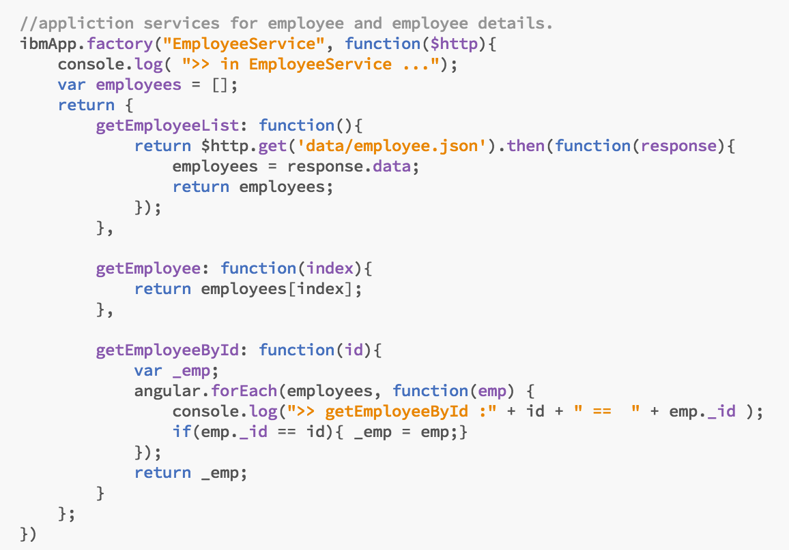

  **Screenshot After:**
   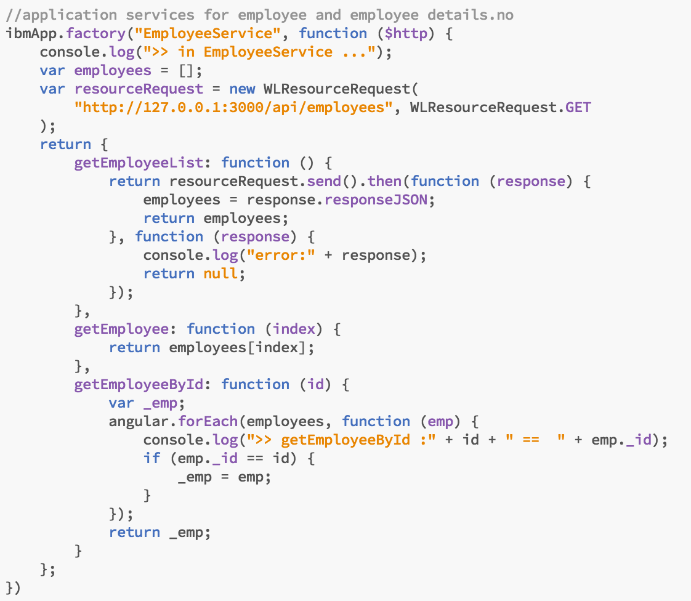

4. **Save** your updates!

###2. Modify the EmployeeDetailsService service to invoke the adapter procedure

EmployeeDetailsService returns details for the specified employee id.  This set of steps will replace the Angular $http processing with WLResourceRequest.

1. Locate the **EmployeeDetailsServices** method in **IBMTechEXEmployee/www/js.app.js**.  You will also replace the current Angluar $http implementation of this service with calls to the MobileFirst Client API.  The service only needs to get the employee details as provided by the adapter.  There is no need to parse and massage the data returned from the server. The filtering (heavy lifting) was done on the adapter side.  When you have hundreds or thousands of employees this is huge time saving which done on the server side.

2. Replace the implementation of the **EmployeeDetailsService** method with the code, below (*use the corresponding snippet file in **/snippets** to copy/paste*):

   ``` javascript
      
		ibmApp.factory("EmployeeDetailsService", function ($http) {
		    console.log(">> in EmployeeDetailsService ...");
		    return {
		        getEmployeeDetails: function (empId) {
		            //using path param.
		            var resourceRequest = new WLResourceRequest(
		                "http://127.0.0.1:3000/api/employees/" + empId, WLResourceRequest.GET
		            );
		            return resourceRequest.send().then(function (response) {
		                return response.responseJSON;
		            }, function (response) {
		                console.log("error:" + response);
		                return null;
		            });
		        }
		    };
		})
   
   ```
   
    **Before:**
    
    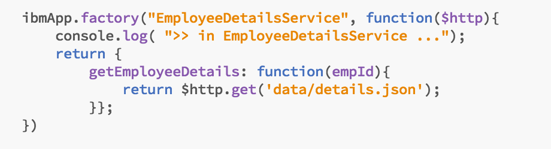  

    **After:**
    
       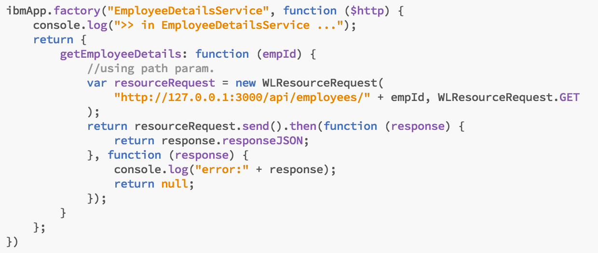

    
3. **Save** your updates!
    
    
###4. Modify the employeeDetailCtrl controller to match the EmployeDetailsService

We no longer need the 'for' loop to parse the complete set of detail data, as our adapter provides a single set of employee detail data for the requested employee id.  We can simplify the client controller to take adavantage of having moved that "business logic" to the server.  

This is a very simple example of offloading logic to the adapter tier, but you can imagine much more complex variations with date/time formatting and calculations, phone numbers, mashups of multiple back-end data sources, calculations, etc...  The adapter modularizes the solution, simplifying and reducing the logic required on the mobile device.

1.  Replace the implementation of the **employeeDetailCtrl** method with the code, below (*use the corresponding snippet file in **/snippets** to copy/paste*):
 

   ``` javascript
   ibmApp.controller('employeeDetailCtrl', function($scope, EmployeeService,
                                 employeeDetailList , empId ,$ionicHistory) {
      $scope.employee = {
            "first_name" : "",
            "last_name" : "",
            "_id" : ""
      }
      $scope.employeeDetails = {}
      console.log(">> in - employeeDetailCtrl:" + employeeDetailList);
      //Employee service cached the list of employee
      $scope.employee = EmployeeService.getEmployeeById(empId);
      $scope.employeeDetails = employeeDetailList;
      $scope.employeeDetails.email =  angular.lowercase($scope.employeeDetails.email);
   
   })

   ```
  
    **Before:**
    
    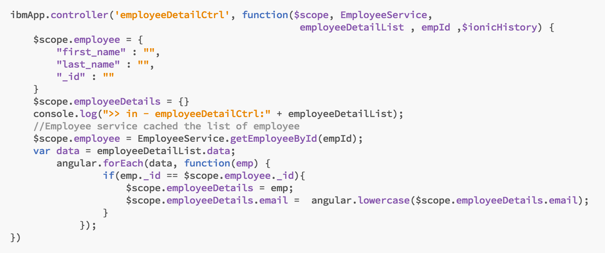  

    **After:**

    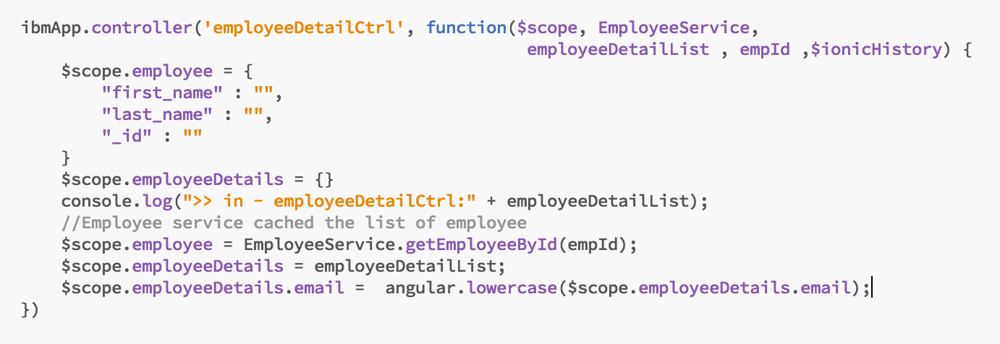
    
2.  **Save** your updates!  
  
  
### Preview the application and review Analytics  
   
1. Return to a terminal prompt with context within **IBMTechEXEmployee** and run the application using the preview or the emulator 

        mfp cordova preview
   
   or
   
        mfp cordova emulate

   We should see our new list of employees coming from StrongLoop.     

   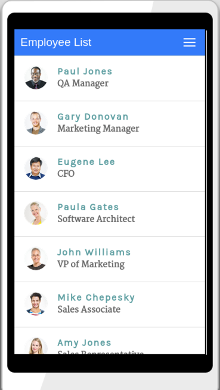


2. Navigate the app screens several times to display the list of users, see user details, logout.  This will generate analytics data that we will see shortly.
   
3. If the Analytics console is open in the browser, refresh it.  Otherwise launch it by starting the Operations Console with
   
   `mfp console`

   Then launch the Analytics dashboard from the icon in the upper right and log in with admin/admin.
   
   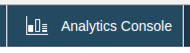

   
4. Review the operational analytics console to can see that we were able to collect metrics about the application usage and backend requests, even though it is not hosted within the server.

   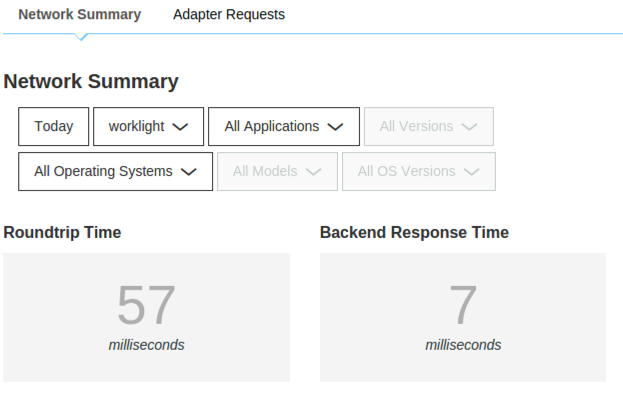


<!-----
> Get pics of these:
> 
> Network - Roundtrip time and Backend response time.
> 
> Dashboard - Total sessions
> 
> Devices - Operating system usage, model usage, OS version usage.
-->  

## Micro Lab 6 - Summary

In this lab, you modified the client code to use the MobileFirst adapter instead of Angular $http calls to retrieve the employee list and detail data.

If you were unable to complete this lab, you can catch up by running this command:

     git checkout -f step-6


